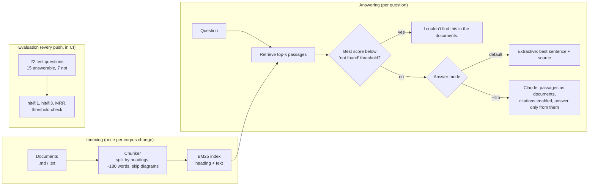
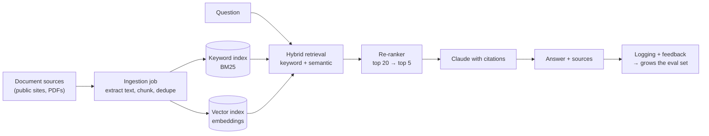

# Architecture: RAG Assistant over Public Documents

> **Retrieval-Augmented Generation (RAG):** instead of trusting what an AI model remembers, first *retrieve* the relevant passages from your own documents, then let the model answer **only from those passages, with citations**. This repo builds the retrieval and evaluation in plain Python and adds Claude as an optional answer generator.

## 1. Goal and scope

| In scope | Out of scope |
|---|---|
| Question answering over a folder of public Markdown/text documents | Private or personal data (rule: public documents only) |
| Measurable retrieval quality, checked automatically in CI | A chat UI or multi-turn conversation memory |
| Answers that cite their sources, and refuse when the answer isn't there | Fine-tuning a model |
| Works without an AI model (extractive mode) | Large-scale corpora (see target design) |

**Sample corpus:** the four `ARCHITECTURE.md` documents from this portfolio's earlier projects (hospital IT resilience, AWS 3-tier, crypto data pipeline, perp risk calculator). They're public and MIT-licensed. Any folder of `.md`/`.txt` files can replace them.

## 2. Design

| Component | File | Responsibility |
|---|---|---|
| Chunker | `rag/chunker.py` | Splits each document at its headings and keeps the heading path (e.g. *"5. ADRs > ADR-003: NAT gateway"*) so each passage is meaningful alone and citable |
| Retriever | `rag/bm25.py`, `rag/index.py` | BM25 keyword ranking over heading + text |
| Answerer | `rag/generate.py` | Extractive answer, or Claude with citations |
| Evaluator | `rag/evaluate.py`, `eval/questions.json` | Measures whether the right passage is retrieved |

## 3. Evaluation results

Measured on `eval/questions.json` (k = 3), reproduced by CI on every push:

| Metric | Result | Meaning |
|---|---|---|
| hit@1 | **0.93** (14/15) | The correct section was the first result |
| hit@3 | **1.00** (15/15) | The correct section was in the top 3 passages sent to the answerer |
| MRR | **0.96** | Average of 1 / rank of the first correct passage |
| Unanswerable questions caught by the threshold | **4 / 7** | See ADR-004: keyword scores can't reliably detect "not in the documents" |
| Answerable questions wrongly rejected | **0** | CI fails if this ever rises above 0 |

**Honest caveats:** 15 answerable questions is a small set, and it was written by the same author as the documents, which flatters lexical search because the wording overlaps. A real deployment needs questions collected from actual users.

## 4. Target design (production scale)

## 5. Architecture Decision Records

### ADR-001: BM25 keyword retrieval first, embeddings later
- **Options:** (a) BM25; (b) embeddings + vector database; (c) hybrid.
- **Decision:** (a) for this version.
- **Why:** No dependencies, no API cost, fully explainable ("these words matched"), and a strong baseline that published RAG work still compares against.
- **Trade-off:** It misses synonyms and paraphrases ("password" vs "credential"). The next step is (c), hybrid retrieval, which usually beats either method alone.

### ADR-002: Heading-aware chunks of about 180 words
- **Why:** Architecture documents are organized by headings, and a heading like *"ADR-003: NAT gateway"* is a strong signal, so it's indexed with the text. Small chunks keep each passage focused. The heading path makes citations readable.
- **Trade-off:** An answer spread across sections needs several passages, so the retriever sends the top 3.

### ADR-003: Grounded generation with citations
- **Decision:** Retrieved passages are sent to Claude as **document blocks with citations enabled**, with a system instruction to answer only from them and to say so when they don't contain the answer.
- **Why:** Every claim in the answer points back to a passage a reader can check, so a hallucination becomes visible instead of hidden.
- **Model:** `claude-opus-5-5` at low effort. Short look-up answers don't need deep reasoning. Server-side fallback is enabled, so a safety-classifier refusal is retried on a suitable model.

### ADR-004: A "not found" threshold, honestly limited
- **Finding:** On the eval set, the weakest answerable question scores 3.58 while one unanswerable question ("How many employees does the cloud team have?") scores 7.21, because it shares words like *cloud* and *team*. **No keyword threshold separates them.**
- **Decision:** Set the threshold at 3.0, so it never rejects an answerable question in the eval set. It catches 4 of 7 unanswerable questions. The rest rely on the grounding instruction in ADR-003.
- **Next step:** Semantic similarity or a re-ranker score is a much better "is this actually answered?" signal than BM25.

### ADR-005: Evaluate retrieval separately from generation
- **Why:** If retrieval doesn't find the right passage, no model can answer correctly. Retrieval metrics are cheap, deterministic and run in CI. Generation quality (faithfulness, completeness) needs model calls and a grading method, and is listed as future work.

### ADR-006: The AI model is optional
- **Why:** The core runs anywhere with Python and costs nothing. The `anthropic` SDK is imported only when `--llm` is used. That keeps CI free and lets the retrieval layer be judged on its own.

## 6. Risk register

| ID | Risk | Likelihood | Impact | Mitigation |
|---|---|---|---|---|
| R-01 | Model states something the passages don't support (hallucination) | Medium | High | Grounding instruction, citations on every claim, refuse when not found |
| R-02 | Prompt injection hidden in a document ("ignore your instructions…") | Low (trusted public corpus) | High | Documents passed as document blocks, not instructions; only curated sources; review new documents |
| R-03 | Unanswerable question answered from loosely related text | Medium | Medium | Threshold (partial, ADR-004) + grounding instruction; hybrid retrieval planned |
| R-04 | Eval set too small and written by the corpus author | High | Medium | Stated openly; grow it from real user questions |
| R-05 | Documents go out of date | Medium | Medium | Re-index on change; show source and section in every answer |
| R-06 | Sensitive data indexed by mistake | Low | High | Public documents only, by policy; no personal data in the corpus |
| R-07 | API cost or availability | Low | Low | Extractive mode needs no API; low effort; retrieval keeps prompts short |

## 7. Cost

| Item | Estimate | Notes |
|---|---|---|
| Retrieval, extractive answers, evaluation | $0 | Local Python |
| Claude answer (`--llm`) | ≈ $0.01 per question | ~1,000 input tokens (3 passages + question) at $4/M, plus a few hundred output tokens at $20/M (Claude Opus 5.5 list prices). Rough estimate: thinking tokens vary per question |
| 1,000 questions/month | ≈ $10/month | Prompt caching would cut this further if the same passages repeat |

## 8. How it is tested

- **Unit tests:** chunking (heading paths, diagrams skipped, long sections split), tokenization, BM25 ranking and IDF, the extractive answer, and the metric functions.
- **Retrieval evaluation in CI:** fails if hit@3 drops below 0.9, or if the "not found" threshold rejects any answerable question.
- **Not tested in CI:** the Claude call, because it needs API credentials. It follows Anthropic's documented SDK usage, and its error handling covers missing credentials, rate limits and network errors.
