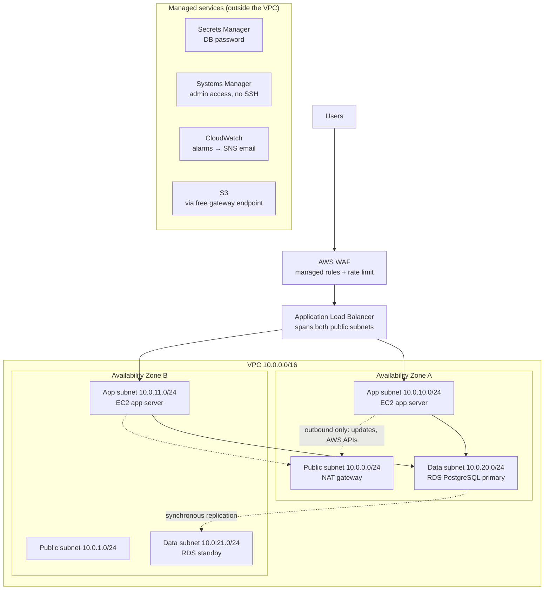
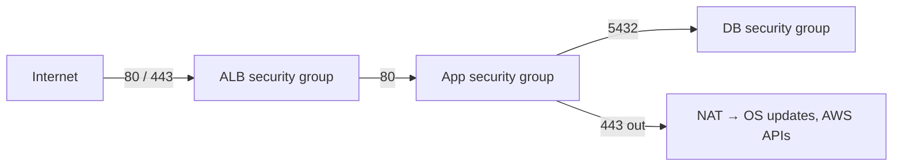
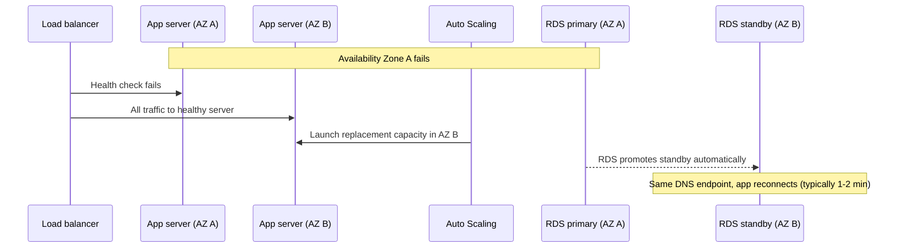

# Architecture: AWS 3-Tier Reference

> A generic reference design for a public web application on AWS: **web tier → app tier → data tier**, spread across two Availability Zones. The Terraform in [`terraform/`](terraform/) implements it and is checked with `terraform validate` in CI. It has **not** been deployed as part of this repository.

## 1. Context and requirements

**Example workload:** a public web application such as an appointment-booking or content portal with a few thousand daily users, a relational database, and no special compliance regime. No real user data is involved.

| Requirement | Target |
|---|---|
| Availability | 99.9% (≈ 43 min of downtime a month). Survives the loss of one server or one Availability Zone |
| Recovery from AZ failure | Automatic. Database failover in minutes, no data loss (synchronous standby) |
| Recovery from accidental data change | Point-in-time restore, last 7 days (RPO ≈ 5 min, RTO ≈ 1 h) |
| Region failure | Out of scope for this version (see ADR-007) |
| Security | No servers reachable from the internet; no passwords in code; encrypted storage; web attack filtering |
| Operations | Small team: managed services where possible, no SSH keys, everything in code |
| Cost | Pilot ≈ $150/month, moderate production ≈ $430/month (see §7) |

## 2. Architecture overview

**The three tiers**

| Tier | Runs in | Reachable from | Main AWS services |
|---|---|---|---|
| **Web** | Public subnets | The internet (80/443) | WAF, Application Load Balancer, NAT gateway |
| **App** | Private subnets, no public IPs | The load balancer only (port 80) | EC2 Auto Scaling group (Graviton, Amazon Linux 2023) |
| **Data** | Isolated subnets, no internet route | The app servers only (port 5432) | RDS for PostgreSQL, Multi-AZ, encrypted |

## 3. Security design

- **Security groups reference each other** rather than IP ranges, so "only the load balancer can reach the app" stays true however servers scale.
- **No SSH and no bastion host.** Admins use AWS Systems Manager Session Manager, which is logged and controlled by IAM. No port 22 is open anywhere.
- **No password in code or Terraform state.** RDS generates the master password and stores it in Secrets Manager (`manage_master_user_password`).
- **IMDSv2 required** on instances. This blocks a well-known way of stealing instance credentials.
- **Encryption at rest** for EBS and RDS. TLS 1.2/1.3 at the load balancer when a certificate is supplied.
- **WAF** with three AWS-managed rule groups (common exploits, known bad inputs, IP reputation) and a per-IP rate limit.

## 4. Failure scenarios

| Failure | What happens | User impact |
|---|---|---|
| One app server crashes | ALB stops sending it traffic; Auto Scaling replaces it | None or a few failed requests |
| Traffic spike | Target tracking adds servers when average CPU > 50% (up to the max size) | Slower responses until new servers are healthy (~2–3 min) |
| Database primary fails | RDS fails over to the standby, same endpoint | ~1–2 min of database errors |
| Whole AZ fails | Both of the above at once | Short disruption, then reduced capacity until AZ returns |
| Bad data written by a bug | Point-in-time restore to a new instance | Manual recovery, up to ~1 h |
| Region fails | Not covered (ADR-007) | Outage until the region recovers |

## 5. Architecture Decision Records

### ADR-001: EC2 Auto Scaling for the app tier (not containers or serverless yet)
- **Options:** (a) EC2 Auto Scaling group; (b) ECS on Fargate; (c) Lambda + API Gateway.
- **Decision:** (a).
- **Why:** It's the simplest to understand and troubleshoot for a team with a server and VM background, it works with any application stack, and Graviton instances keep it cheap.
- **Trade-offs:** We patch the OS (handled by replacing instances from the latest AMI), and scaling is slower than with containers. **Revisit** when the app is containerized. ECS Fargate is the natural next step.

### ADR-002: RDS for PostgreSQL Multi-AZ (not Aurora, not self-managed)
- **Options:** (a) PostgreSQL on EC2; (b) RDS PostgreSQL Multi-AZ; (c) Aurora PostgreSQL.
- **Decision:** (b).
- **Why:** Managed backups, patching and automatic failover at the lowest managed price for this size.
- **Trade-offs:** Failover takes ~1–2 min. Aurora fails over faster and scales reads better, but costs more at small sizes.

### ADR-003: NAT gateway: one shared by default, one per AZ in production
- **Context:** In the small scenario, NAT and its public IP are about **25% of the whole bill**.
- **Options:** (a) one NAT per AZ; (b) one shared NAT; (c) no NAT, only VPC interface endpoints.
- **Decision:** (b) by default, (a) for production (`nat_gateway_per_az = true`). A free S3 gateway endpoint is always on.
- **Why:** Losing the single NAT only stops *outbound* traffic (updates). User traffic keeps flowing, which is acceptable for a pilot. Option (c) needs several interface endpoints at ~$7/month each per AZ, and that ends up costing more than one NAT.

### ADR-004: Systems Manager instead of SSH or a bastion host
- **Decision:** Session Manager only. No key pairs, no port 22.
- **Why:** There are no keys to lose or rotate, every session is logged, and access is granted and revoked through IAM.

### ADR-005: Managed database password in Secrets Manager
- **Decision:** `manage_master_user_password = true`.
- **Why:** The password never appears in code, tfvars or Terraform state, and RDS can rotate it.

### ADR-006: Graviton (arm64) instances
- **Decision:** t4g for both EC2 and RDS.
- **Why:** Lower price than the equivalent x86 instance types. The trade-off is that third-party software must support arm64. Check this before choosing it for a specific application.

### ADR-007: Multi-AZ in one region, not multi-region
- **Options:** (a) single AZ; (b) multi-AZ in one region; (c) active/passive in two regions.
- **Decision:** (b).
- **Why:** It covers the common failures (server, AZ) at a fraction of the cost and complexity of (c). A cheap first step towards regional resilience would be copying snapshots to a second region with AWS Backup.
- **Region choice:** `us-east-1` is the default because it's usually the cheapest. For users in the Middle East, a nearer region such as `eu-central-1` (Frankfurt) or `me-central-1` (UAE) gives lower latency at a somewhat higher price. Data-residency rules may also decide it.

## 6. Risk register

| ID | Risk | Likelihood | Impact | Mitigation |
|---|---|---|---|---|
| R-01 | Costs grow unnoticed (data transfer, NAT, logs) | Medium | Medium | AWS Budgets alert; cost model reviewed each quarter; S3 gateway endpoint |
| R-02 | Single shared NAT fails | Low | Low–Medium | Only outbound traffic affected; switch to NAT per AZ for production |
| R-03 | Terraform state lost or exposed | Medium | High | Remote state in an encrypted, versioned S3 bucket with locking (not included in this demo) |
| R-04 | Database deleted by mistake | Low | Critical | Deletion protection on by default, final snapshot, 7-day point-in-time restore |
| R-05 | Credentials leaked from an instance | Low | High | IMDSv2 only, least-privilege instance role, no long-lived keys |
| R-06 | Web attacks (injection, bots) | High | Medium | WAF managed rules + rate limit; keep the app patched |
| R-07 | App doesn't run on arm64 | Medium | Medium | Test before choosing Graviton; switch to x86 types (t3) if needed |
| R-08 | Region-wide outage | Very low | High | Accepted for now; snapshot copy to a second region as the next step |
| R-09 | AWS prices in this repo are out of date | High | Low | Prices labelled as approximate; confirm in the AWS Pricing Calculator |

## 7. Cost model

Run `python cost/cost_model.py` to get the full line-by-line tables. The unit prices are in [`cost/pricing.json`](cost/pricing.json) and are **approximate us-east-1 on-demand list prices, entered by hand and not checked against the live price list**. Treat the totals as order-of-magnitude estimates.

| Scenario | What it includes | Estimated USD / month |
|---|---|---|
| **Small** (Terraform defaults) | 2 × t4g.small, 1 NAT, db.t4g.micro Multi-AZ, 100 GB out | **≈ 148** |
| **Production** (moderate) | 4 × t4g.medium, 2 NAT, db.t4g.medium Multi-AZ, 500 GB out | **≈ 427** |

**What the numbers show**

- In the small scenario, the **fixed networking costs** (NAT gateway, public IPv4 addresses, load balancer) are about **half the bill**, more than the servers and database combined. That's why ADR-003 starts with one NAT.
- In production, **compute and database** become the largest share (about half of the total, including their storage), which is where the optimizations below help most.

**Ways to reduce cost** (not included in the estimate)
- Compute Savings Plans or Reserved Instances for steady 24/7 servers and databases.
- Turn off non-production environments outside working hours.
- Single-AZ database for development (not production).
- Keep logs for only as long as needed (CloudWatch retention, S3 lifecycle rules).
- Put CloudFront in front of the load balancer when much of the traffic is cacheable static content.

## 8. AWS Well-Architected mapping

| Pillar | How this design addresses it |
|---|---|
| Operational excellence | Everything in Terraform; CI validation; alarms to email; instance refresh for safe rollouts |
| Security | Tiered security groups, no SSH, IMDSv2, Secrets Manager, encryption, WAF |
| Reliability | Two AZs, Auto Scaling with ELB health checks, RDS Multi-AZ, automated backups |
| Performance efficiency | Target-tracking scaling; Graviton instances; gp3 storage |
| Cost optimization | Shared NAT by default, S3 gateway endpoint, cost model with explicit assumptions |
| Sustainability | Graviton (better performance per watt); scale-in when idle |

## 9. Not included (next steps)

Remote Terraform state, HTTPS certificate and DNS (Route 53), ALB access logs, VPC flow logs, AWS Backup cross-region copy, CI/CD pipeline for the application, and a real application.
