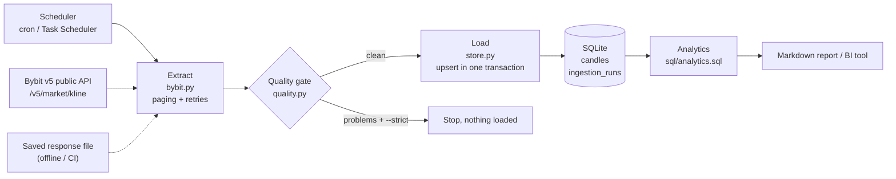
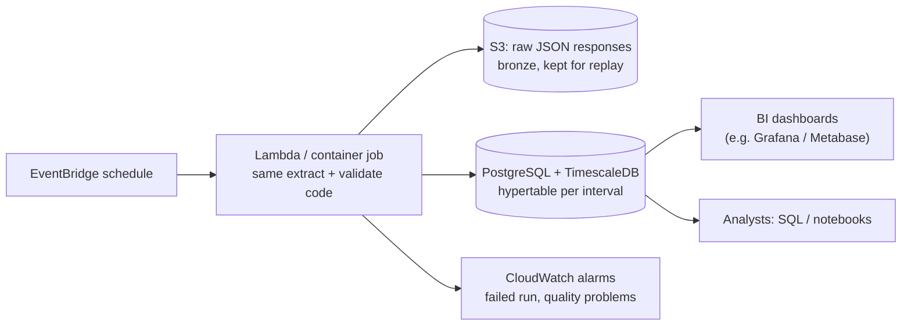

# Architecture: Crypto Market Data Pipeline

> A small, honest batch pipeline: **extract** candles from Bybit's public market API, **validate** them, **load** them idempotently into SQL, and **analyze** them with window-function queries. Standard-library Python, no API key, no trading.

## 1. Goal and scope

| In scope | Out of scope |
|---|---|
| Historical and recent OHLCV candles for any Bybit symbol and interval | Placing orders or touching an account (no API keys at all) |
| Repeatable, safe re-runs and backfills | Tick-level or order-book data |
| Data-quality checks and an audit trail of every load | Real-time streaming (see ADR-003) |
| SQL analytics: returns, moving averages, volatility, drawdown, volume patterns | Trading signals or investment advice |

## 2. Current design (reference implementation)



| Step | What it does | Why it matters |
|---|---|---|
| **Extract** | Builds the request, pages backwards 1,000 candles at a time, retries temporary errors (HTTP 429/5xx) with exponential backoff, pauses between pages | Backfills of any length; polite to the API's rate limits |
| **Validate** | Checks high ≥ open/close ≥ low, positive prices, non-negative volume, and **no missing candles** | Bad data is caught *before* it reaches reports |
| **Load** | `INSERT … ON CONFLICT DO UPDATE` keyed on (symbol, interval, open time), in a single transaction, and records the run in `ingestion_runs` | Re-running is always safe; every row can be traced to a load |
| **Analyze** | Named SQL queries using `LAG`, moving `AVG` windows and running `MAX` | Analytics live in SQL, where analysts can read and reuse them |

## 3. Target design (when it outgrows one machine)



The extract and validate code stays the same. Only the storage layer and the scheduler change. Keeping raw responses in object storage means any bug in transformation can be fixed and **replayed** without calling the API again.

## 4. Data model

```
candles(symbol, interval, open_time PK, open, high, low, close, volume, turnover, ingested_at)
ingestion_runs(id PK, run_at, source, symbol, interval, rows_received)
```

- `open_time` is stored as UTC Unix milliseconds, exactly as Bybit sends it. That's unambiguous and sorts correctly. Queries convert it to a date only for display.
- `volume` is in the base coin (e.g. BTC) and `turnover` is in the quote coin (e.g. USDT).

**Sizing:** one symbol of 1-minute candles is ~525,600 rows/year, roughly 50 MB in SQLite. Fifty symbols at 1 minute is ~26 million rows/year. That's the point to move to PostgreSQL/TimescaleDB (ADR-001).

## 5. Architecture Decision Records

### ADR-001: SQLite now, PostgreSQL/TimescaleDB later
- **Options:** SQLite; PostgreSQL; TimescaleDB; files in Parquet + a query engine.
- **Decision:** SQLite for the reference implementation.
- **Why:** Zero setup, a single file, full SQL with window functions, and it's in Python's standard library.
- **Revisit when:** several writers or users need access at once, or data grows past a few GB. TimescaleDB adds time-based partitioning and compression on top of PostgreSQL, and the SQL stays almost the same.

### ADR-002: Idempotent upsert on a natural key
- **Decision:** primary key `(symbol, interval, open_time)` with `ON CONFLICT DO UPDATE`.
- **Why:** Backfills overlap, jobs get re-run after failures, and **Bybit's newest candle is still open and keeps changing until its period closes**. Upsert means the latest run always wins, with no duplicates. "Insert-or-ignore" would leave a stale, half-finished candle in place forever.

### ADR-003: REST polling of candles, not WebSocket streaming
- **Options:** REST batch polling; WebSocket live stream.
- **Decision:** REST.
- **Why:** The use case is analytics on closed candles, where minutes of delay don't matter. REST is simpler, easy to retry and easy to backfill. A WebSocket consumer is the right choice for live dashboards or alerting, and it can write into the same table.

### ADR-004: Floating-point prices for analytics only
- **Decision:** `REAL` (floating point) columns.
- **Why:** Fine for returns, averages and volatility.
- **Trade-off:** floats can't represent every decimal exactly. Anything involving money owed (PnL statements, balances, fees) must use `NUMERIC`/decimal types instead.

### ADR-005: Quality gate before load, plus an audit table
- **Decision:** Every batch is checked. `--strict` refuses to load a batch with problems, and every load is logged in `ingestion_runs`.
- **Why:** It's cheaper to stop bad data at the door than to find it later in a report. The audit table answers "where did this number come from?"

### ADR-006: Standard library only
- **Decision:** No pandas, no requests, no ORM.
- **Why:** Nothing to install, a small supply-chain surface, and every line is readable.
- **Trade-off:** less convenient exploratory analysis. Notebooks with pandas can still read the SQLite file directly.

## 6. Risk register

| ID | Risk | Likelihood | Impact | Mitigation |
|---|---|---|---|---|
| R-01 | API unavailable from some countries or cloud regions (e.g. US-based servers) | High | Medium | Run where the service is permitted; CI uses a saved sample; respect Bybit's terms of service |
| R-02 | Rate limiting / temporary errors | Medium | Low | Backoff on 429/5xx, pause between pages, resumable idempotent loads |
| R-03 | API response format changes | Low | High | Strict parsing fails loudly; tests pin the expected format; version (`v5`) is explicit in the URL |
| R-04 | Partial (still-open) candle used in analysis | High | Low–Medium | Upsert corrects it next run; filter out the latest candle for end-of-period reports |
| R-05 | Missing candles (exchange outage, maintenance) | Medium | Medium | Gap detection in the quality gate; re-run the backfill for that window |
| R-06 | Analysis mistaken for trading advice | Medium | Medium | Clear scope statement; descriptive statistics only |
| R-07 | Single exchange = single view of the market | High | Low | Schema already has `symbol`; add an `exchange` column when adding sources |

## 7. Cost

| Setup | Monthly cost (approx.) | Notes |
|---|---|---|
| Local / on a small office server (current design) | $0 | Bybit public market data is free; SQLite is free |
| Small cloud VM or VPS running cron | ~$5–10 | Enough for dozens of symbols at 1-hour candles |
| AWS target design (Lambda + S3 + small PostgreSQL) | ~$15–25 | Dominated by the database (db.t4g.micro single-AZ ≈ $12/month at on-demand rates); Lambda and S3 are cents at this volume. Approximate prices, so verify in the AWS Pricing Calculator |

## 8. How it is tested

Unit tests run on every push (GitHub Actions). They cover parsing of the real Bybit response format, backwards paging across 2,500 candles with a fake API, quality checks, idempotent upserts, and **every SQL query, with results checked against values worked out by hand**. CI then runs the full pipeline end to end on the bundled synthetic sample.
