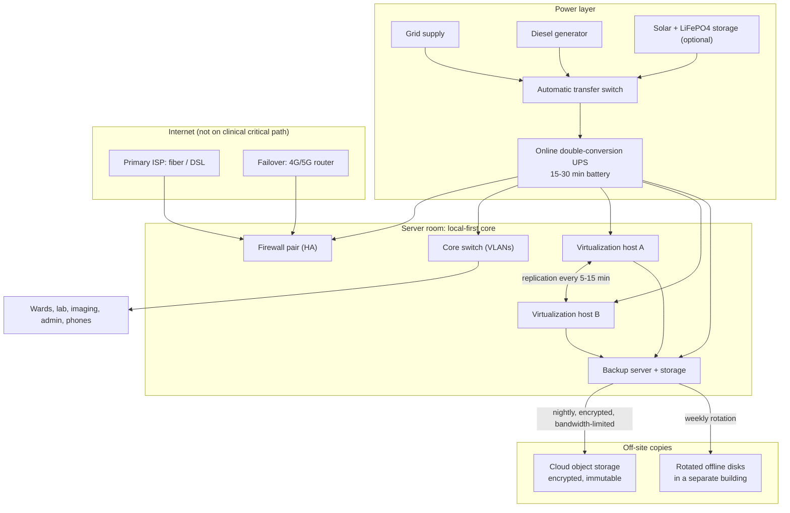
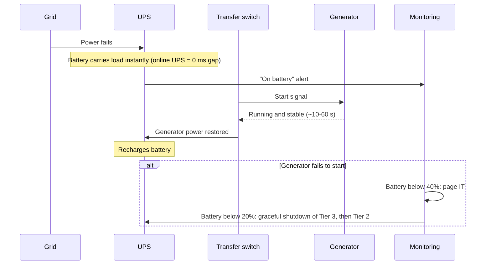
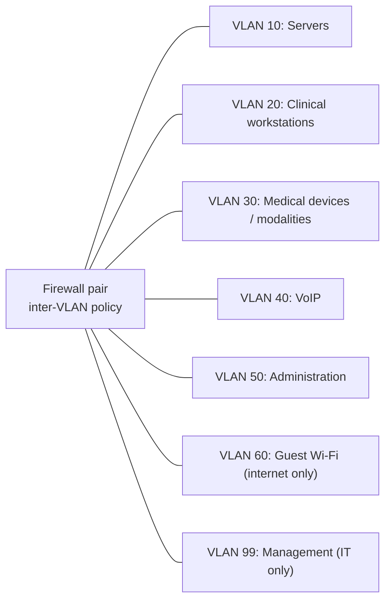
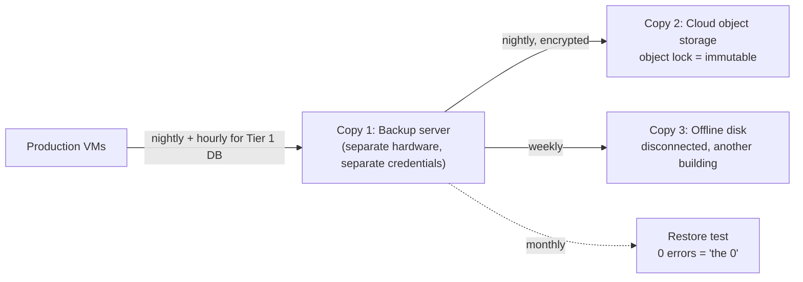

# Architecture: Resilient IT for a Public Hospital in a Resource-Constrained Environment

> **Scope note.** This is a *generic reference architecture*. It does not describe the network, servers, backups or weaknesses of any real hospital. All sizes, loads and prices are planning assumptions.

## 1. Context

Many public hospitals run their clinical IT under conditions that cloud-first designs don't account for:

| Constraint | What it looks like in practice |
|---|---|
| **Unreliable grid power** | The grid supplies only a few hours a day, generators carry the rest, and diesel supply and price can swing |
| **Weak or expensive internet** | Low bandwidth, outages lasting hours or days, high cost per Mbps |
| **Small budget, unstable currency** | Hardware often bought in USD, with long procurement cycles and some refurbished equipment |
| **Few IT staff** | Often one person or a small team, sometimes part-time, plus vendors for specialist systems |
| **Clinical stakes** | Admissions, lab, imaging, pharmacy and phones must keep working 24/7 |

**Design goal:** clinical systems stay available inside the hospital through power cuts, internet loss and single hardware failures, and data can be recovered after ransomware or a total server loss. All of this with commodity hardware that a small team can run.

## 2. Assumed reference site

These figures make the sizing concrete. They are illustrative, not taken from a real site.

| Item | Assumption |
|---|---|
| Size | ~150 beds, ~300 endpoints (PCs, printers, phones), one main building plus annexes |
| Core applications | Hospital information system (HIS/EMR), lab information system (LIS), PACS viewer, pharmacy, billing, email, file shares, VoIP |
| Data volume | ~4 TB total, growing ~1 TB/year (mostly imaging) |
| Server room load | ~1.6 kW on the UPS (see [`data/sample_load.csv`](data/sample_load.csv)) |

## 3. Service tiers and recovery targets

Not everything needs the same protection. Tiering keeps spending focused on what matters clinically.

| Tier | Services | RTO (time to restore) | RPO (max data loss) | Must work without internet? |
|---|---|---|---|---|
| **1: Clinical critical** | HIS/EMR, LIS, PACS viewing, pharmacy, internal phones | ≤ 1 hour | ≤ 15 minutes | **Yes** |
| **2: Business** | Billing, file shares, directory/login, printing | ≤ 8 hours | ≤ 4 hours | Yes |
| **3: Convenience** | Email, internet browsing, guest Wi-Fi | ≤ 48 hours | ≤ 24 hours | No |

## 4. Architecture overview

The core idea is that **the hospital runs its clinical systems locally**. The internet is used for off-site backup, email and remote vendor support. It is never needed to admit a patient or read a lab result.

## 5. Components

### 5.1 Power

- An **online double-conversion UPS** protects the server room. It has no transfer gap and cleans up the poor-quality power that generators often produce.
- The battery is sized to **bridge the generator start and give time for a graceful shutdown if the generator fails**. It is not meant to run for hours. 15–30 minutes is the target, and [`tools/ups_runtime.py`](tools/ups_runtime.py) does the sizing.
- **LiFePO4** batteries are preferred over lead-acid where budget allows. They have more usable capacity, last more cycles and tolerate heat better, which matters when outages happen every day.
- Optional **solar + storage** cuts diesel use for the daytime base load. It's a cost decision, not a resilience requirement (see ADR-002).
- Network closets on wards get small line-interactive UPS units, so the phones and access switches stay up during the generator transfer.

### 5.2 Network and segmentation

- **Default deny between VLANs.** Clinical workstations reach only the application ports they need on the servers. Medical devices reach only their PACS or LIS interface.
- **Medical devices are isolated** because they often run old, unpatched operating systems that cannot be updated.
- Guest Wi-Fi only gets internet access and is rate-limited so it can't use up the link.
- The management VLAN (switch, UPS and server consoles) is reachable only from IT workstations.

### 5.3 Compute and storage

- **Two virtualization hosts** (e.g., Proxmox VE or Hyper-V) with **VM replication** every 5–15 minutes for Tier 1 VMs. If host A fails, Tier 1 VMs are started on host B from the latest replica, which meets the ≤ 15 min RPO and ≤ 1 h RTO.
- Each host has enough RAM and disk to run **all Tier 1 and Tier 2 VMs on its own**, with Tier 3 left off if needed.
- RAID 1/10 on local disks avoids a SAN, which would be a single point of failure the team can't afford to run (see ADR-003).

### 5.4 Backup: 3-2-1-1-0

- **3** copies, on **2** types of media, **1** off-site, **1** offline or immutable, **0** errors in tested restores.
- The backup server is **not joined to the main domain** and uses separate admin credentials, so ransomware that takes the domain can't delete the backups.
- Cloud upload is **bandwidth-limited and scheduled at night**. Only incremental changes are sent after the first full seed, which can be done by courier disk if the provider supports it.
- **Restore tests are monthly and documented.** A backup that has never been restored is an assumption, not a backup.

### 5.5 Internet

- **Dual-WAN** on the firewall: a fixed line as primary and a cellular router as automatic failover. A satellite link is optional where it's licensed and affordable.
- Policy-based routing keeps the failover link for backups, email and vendor support. Guest traffic is dropped while on failover.

### 5.6 Identity, security and monitoring

- Central directory (e.g., Active Directory or Samba AD) with **MFA for remote access and all admin accounts**.
- Endpoint protection on every PC, patching through a local update cache so the hospital doesn't download the same update 300 times over a weak link, and local admin rights removed from users.
- Remote vendor access only through VPN with time-limited accounts. No permanently open remote desktop ports.
- **Monitoring** (e.g., Zabbix) for UPS battery and runtime, generator status (where a contact or SNMP output exists), host health, backup job results and WAN status, with alerts by SMS or messaging app so they still arrive when email is down.

### 5.7 Telephony

- An on-premises IP PBX (e.g., Asterisk/FreePBX) on the replicated VM cluster, with **PoE switches on UPS** so the phones stay up during power transfers.
- An analog or GSM gateway keeps at least a few external lines working when internet or SIP trunks are down.

### 5.8 Downtime procedures

Technology alone isn't enough. Each department keeps **paper downtime forms** and a **read-only downtime report** (e.g., the current inpatient list and medications, exported every hour to a protected PC on the UPS). Short runbooks are in [`docs/runbooks.md`](docs/runbooks.md).

## 6. Architecture Decision Records

### ADR-001: Local-first core, cloud only for off-site copies
- **Context:** Internet is slow and unreliable, while clinical work cannot stop.
- **Options:** (a) cloud-hosted HIS; (b) hybrid with cloud as primary; (c) on-premises core with cloud for backup only.
- **Decision:** (c).
- **Consequences:** Clinical services keep working through internet outages. The hospital owns its hardware lifecycle and power problem. Cloud costs stay small and predictable.

### ADR-002: Online UPS sized to bridge the generator, not for long runtime
- **Context:** Outages happen every day, and a generator exists but takes time to start and is not always reliable.
- **Options:** (a) line-interactive UPS; (b) online UPS with 15–30 min of battery; (c) large battery bank for several hours; (d) solar + storage.
- **Decision:** (b) for the server room, line-interactive UPS units for ward closets, and (d) as an optional later phase justified by diesel savings.
- **Consequences:** Affordable and gives time for a controlled shutdown if the generator fails. Long outages still depend on diesel supply, which is an operational risk (R-02).

### ADR-003: Two hosts with replication instead of a SAN or hyperconverged cluster
- **Context:** One or two IT staff, a limited budget, and the need to survive one server failure.
- **Options:** (a) single server; (b) two hosts with asynchronous VM replication; (c) three-node hyperconverged cluster; (d) shared SAN.
- **Decision:** (b).
- **Consequences:** Simple to run and survives a host failure with minutes of data loss. Failover is manual or semi-automatic rather than instant, which is acceptable for an RTO of ≤ 1 h.

### ADR-004: 3-2-1-1-0 backups with an isolated backup server
- **Context:** Ransomware is the most likely way to lose all data. It targets backups first.
- **Options:** (a) backups on the same hosts; (b) domain-joined backup server; (c) isolated backup server + immutable cloud copy + offline disk.
- **Decision:** (c).
- **Consequences:** Survives ransomware and site loss. It costs a separate box, monthly restore tests and a weekly disk rotation that someone must actually do.

### ADR-005: Internet kept off the clinical critical path, with cellular failover
- **Context:** Fixed-line internet goes down regularly.
- **Options:** (a) single ISP; (b) dual-WAN with cellular failover; (c) two fixed ISPs.
- **Decision:** (b), with a second fixed ISP added only if available and affordable.
- **Consequences:** Email, vendor support and backups survive most outages. Cellular data costs must be controlled with routing policy.

### ADR-006: VLAN segmentation with firewall-enforced inter-VLAN policy
- **Context:** A flat network lets one infected PC reach every server and medical device.
- **Options:** (a) flat network; (b) VLANs routed on the core switch with ACLs; (c) VLANs routed through the firewall with stateful rules.
- **Decision:** (c) for traffic between security zones. High-volume traffic, like PACS between modalities and the server VLAN, may be routed on the core switch with ACLs if the firewall can't carry it.
- **Consequences:** Limits the blast radius and gives logs for investigation. Rules need maintaining and must be documented.

## 7. Risk register

| ID | Risk | Likelihood | Impact | Mitigation | Residual |
|---|---|---|---|---|---|
| R-01 | Generator fails to start during a grid outage | Medium | High | UPS bridge + alerting + graceful shutdown order; monthly generator test under load | Medium |
| R-02 | Diesel shortage during long outages | Medium | High | Fuel reserve policy; optional solar to cut daytime consumption; Tier 3 load shedding | Medium |
| R-03 | Ransomware encrypts servers | Medium | Critical | Segmentation, MFA, patching, isolated + immutable + offline backups, tested restores | Low–Medium |
| R-04 | Host hardware failure | Medium | High | Second host with replicas; spare disks on site | Low |
| R-05 | Extended internet outage | High | Low–Medium | Local-first design; cellular failover; local update cache | Low |
| R-06 | UPS batteries degrade unnoticed | High | High | Monitor runtime estimate; size with an aging factor; yearly runtime test | Low |
| R-07 | Server room overheating when cooling loses power | Medium | High | Temperature alerts; cooling on generator circuit; shutdown thresholds | Medium |
| R-08 | Key-person dependency (small IT team) | High | High | Runbooks, documented passwords in a sealed vault, vendor contacts, cross-training | Medium |
| R-09 | Unpatchable medical devices compromised | Medium | High | Isolated VLAN; allow-list only to PACS/LIS; no internet access | Low–Medium |
| R-10 | Backups exist but don't restore | Medium | Critical | Monthly restore test with a written record (the "0" in 3-2-1-1-0) | Low |

## 8. Indicative cost model

> **Planning-level ranges only, not quotes.** They are in USD, assume hardware bought in 2026, and import duties and local margins can change them a lot. Check every line with local vendors before budgeting.

### One-time (CAPEX)

| Item | Minimum viable | Recommended |
|---|---|---|
| 2× virtualization hosts (refurbished vs. new entry enterprise) | 5,000 | 14,000 |
| Backup server + disks | 1,500 | 4,000 |
| Offline rotation disks (4×) | 400 | 800 |
| Online UPS for server room, 3–6 kVA, 15–30 min (sized with `tools/ups_runtime.py`) | 2,000 | 5,000 |
| Small UPS units for network closets (×6) | 900 | 2,400 |
| Firewall pair (open-source firewall on appliances) | 800 | 3,000 |
| Managed switches (VLAN, PoE where needed) | 3,000 | 10,000 |
| Cellular failover router | 200 | 600 |
| Server room temperature sensors | 100 | 400 |
| **Total (rounded)** | **~14,000** | **~40,000** |

Optional solar + LiFePO4 storage varies too much with site and size to give a useful range here. It needs its own business case based on diesel cost per kWh.

### Recurring (OPEX, per year)

| Item | Estimate | Note |
|---|---|---|
| Cloud object storage, ~5 TB with immutability | 100–500 | Cold or archive tiers are cheapest. Check retrieval fees before choosing |
| Cellular failover data | 200–600 | Depends on local tariffs and policy routing |
| Software subscriptions | 0–2,000 | Proxmox VE, Proxmox Backup Server, Zabbix, Asterisk and open-source firewalls are free; paid support is optional |
| UPS battery replacement reserve | 500–1,500 | Lead-acid ~3–5 years, LiFePO4 longer |
| Spare parts (disks, PSUs, SFPs) | 300–1,000 | |

**Why open-source here:** licence costs that recur in USD are a real risk where the currency is unstable. Each open-source choice above has an optional paid support path if the hospital later wants it.

## 9. Phased rollout

1. **Phase 1 (biggest risk reduction per dollar):** isolated backup server + offline disk rotation + monthly restore test; UPS monitoring and shutdown order.
2. **Phase 2:** VLAN segmentation, firewall pair, MFA on admin and remote access.
3. **Phase 3:** second virtualization host with replication; cellular failover.
4. **Phase 4 (optional):** solar + storage business case; second fixed ISP.

## 10. Out of scope

Clinical application selection, medical device procurement, building electrical design (this document only states the requirements on it) and regulatory certification.
