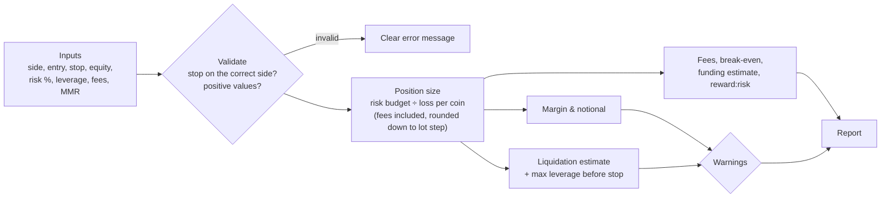

# Architecture: Perpetual Futures Risk Calculator

> A small, transparent calculator that answers the questions to ask **before** opening a leveraged perpetual futures position: *How big? Where is liquidation? What do fees and funding cost? Is my stop even reachable?* Educational. It doesn't connect to any exchange and isn't investment advice.

## 1. Problem

Perpetual futures let a trader control a large position with a small deposit (margin). The common, avoidable mistakes are mechanical:

1. **Sizing by leverage instead of by risk.** "10x" says nothing about how much money is lost if the stop is hit.
2. **Liquidation before the stop.** With high leverage, the exchange closes the position *before* price reaches the stop, so the planned exit never happens.
3. **Ignoring fees and funding.** Both sides of the trade pay fees, and funding is charged every 8 hours on the *whole position value*, not on the margin.

The calculator makes all three visible in one run.

## 2. Design

| Layer | File | Responsibility |
|---|---|---|
| Core maths | `perprisk/calculator.py` | Pure functions with no input/output and no network, so they're easy to test and reuse (CLI, web page, spreadsheet add-in) |
| Interface | `perprisk/__main__.py` | Command line: parse arguments, call `analyze()`, print a readable report |
| Tests | `tests/test_calculator.py` | Every formula checked against hand-calculated values |

## 3. The formulas

Notation: *E* = entry, *S* = stop, *L* = leverage, *m* = maintenance margin rate, *f* = fee rate per side, *q* = quantity.

| Quantity | Formula | Where it comes from |
|---|---|---|
| Risk budget | equity × risk% | What you decide you can lose |
| Loss per coin at stop | \|E − S\| + f × (E + S) | Price move plus entry fee plus exit fee |
| Position size *q* | risk budget ÷ loss per coin, rounded **down** to the lot step | So that hitting the stop loses (at most) the risk budget |
| Initial margin | q × E ÷ L | Deposit the exchange requires |
| Liquidation (long) | E × (1 − 1/L + m) | Price where remaining margin = maintenance margin |
| Liquidation (short) | E × (1 + 1/L − m) | Mirror image |
| Max leverage before stop (long) | 1 ÷ (1 + m − S/E) | Solve "liquidation = stop" for L |
| Break-even (long) | E × (1 + f) ÷ (1 − f) | Exit price where profit exactly pays both fees |
| Funding cost | q × E × rate × (hours ÷ 8) | Paid by longs when the rate is positive, received by shorts |

**Worked example:** long at 60,000, stop at 58,800 (2% away), equity 10,000, risk 1% ($100), 10x, fee 0.055%, MMR 0.5%:
- loss per coin = 1,200 + 65.34 = 1,265.34, so size = **0.0790 BTC** (0.079 with a 0.001 lot step)
- position value ≈ 4,740, margin ≈ **474** at 10x
- liquidation ≈ **54,300**, well beyond the stop. The stop stays reachable up to **40x**
- at 50x, liquidation ≈ 59,100 is *above* the stop, and the calculator warns

**Key insight:** for a fixed stop and risk budget, **leverage doesn't change the position size or the loss at the stop**. It only changes how much margin is locked up and where liquidation sits.

## 4. Architecture Decision Records

### ADR-001: Isolated margin with a single flat maintenance rate
- **Options:** (a) isolated margin, flat MMR; (b) exchange-exact tiered MMR per symbol; (c) cross margin across the account.
- **Decision:** (a).
- **Why:** Explainable in one line per formula and good enough to catch the big mistakes.
- **Trade-off:** It differs slightly from exchange figures. Exchanges use tiered maintenance rates for large positions, liquidation fees, and the **mark price** rather than the last traded price. The output is labelled "estimate".

### ADR-002: Size by risk, with fees inside the sizing formula
- **Decision:** Fees are part of the loss per coin.
- **Why:** If fees are left out, a "1% risk" trade actually loses more than 1%. In the example, fees are ~5% of the total loss at the stop.

### ADR-003: Round quantity down to the lot step
- **Why:** Exchanges only accept multiples of a minimum quantity. Rounding *down* guarantees the real risk is never above the target, and the tool warns if the result rounds down to zero.

### ADR-004: Pure functions, no exchange connection, no API keys
- **Why:** Nothing to leak and nothing that can place an order by accident. The same core can be put behind a web form later without changing the maths.

### ADR-005: Floating-point arithmetic
- **Why:** These are planning estimates shown to 2 decimals, so floats are accurate enough. Order placement or accounting would use decimals and the exchange's tick and lot rules.

## 5. Risk register

| ID | Risk | Likelihood | Impact | Mitigation |
|---|---|---|---|---|
| R-01 | Estimate differs from the exchange's liquidation price | High | Medium | Labelled as estimate; compare with exchange; use a buffer, not the exact figure |
| R-02 | Wrong fee or MMR assumptions for a user's tier or symbol | Medium | Medium | All configurable; defaults documented as typical values to check |
| R-03 | Tool mistaken for advice on *what* to trade | Medium | Medium | Explicit disclaimer; it only does arithmetic on the user's own plan |
| R-04 | Funding rate changes during the trade | High | Low–Medium | Shown as an estimate at the current rate; recompute while holding |
| R-05 | Gaps and slippage: price jumps past the stop | Medium | High | Out of model scope; documented. Real loss can exceed the planned loss |

## 6. Cost

$0. It runs locally with Python's standard library. A static web version, if added later, could be hosted free on GitHub Pages.

## 7. Possible extensions

- A browser version (single HTML page, same formulas in JavaScript, with the Python tests as the reference).
- Exchange-specific profiles (tiered MMR tables, fee tiers) loaded from a config file.
- Portfolio view: total margin and combined loss if every stop is hit.
